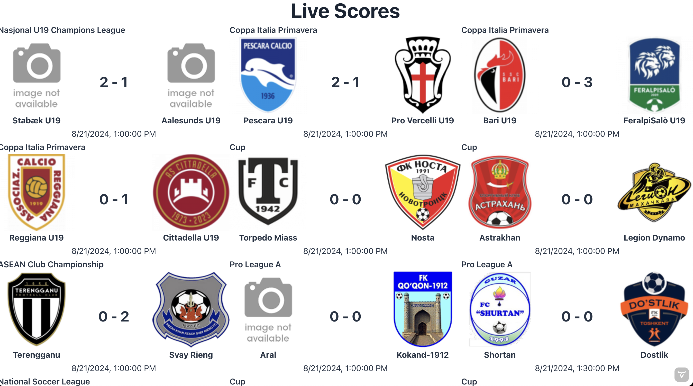

# 🏆 Live Score App with Reactive Spring Boot 🏆

## Table of Contents

1. [Introduction](#introduction) 
2. [Project Goals](#project-goals) 
3. [Reactive Programming with Spring Boot](#reactive-programming-with-spring-boot) 
    - [What is Reactive Programming?](#what-is-reactive-programming) 
    - [Why Use Reactive Programming?](#why-use-reactive-programming) 
    - [How Spring Boot Implements Reactive Programming](#how-spring-boot-implements-reactive-programming) 
4. [How It Works](#how-it-works) 
5. [Technologies Used](#technologies-used) 
6. [Getting Started](#getting-started) 
7. [App Screenshots](#app-screenshots) 
8. [Support](#support) 
9. [License](#license) 

## Introduction

> Live Score App, an application that delivers real-time sports scores using reactive programming principles. This project showcases the power of Spring Boot's reactive 🍃 capabilities combined with a modern frontend with Vaadin's Hilla ⚛️ project.

💡 This application is not business oriented and my focus is mostly on technical part, I just want to implement a sample app that uses reactive programming with Spring Boot to put in practice what I have learned.

🌀 This Application is in-progress and I will add some improvements and features over time 🌀

## Project Goals

The primary objectives of this project are:

1. To demonstrate the implementation of reactive programming in a real-world application.
2. To create a user-friendly interface for accessing live sports scores.
3. To serve as an educational resource for developers interested in reactive programming with Spring Boot.

## Reactive Programming with Spring Boot

### What is Reactive Programming?

Reactive programming is a paradigm focused on building asynchronous, non-blocking, and event-driven applications that can scale effectively. It's particularly well-suited for applications that deal with streams of data or require high concurrency.

Key concepts in reactive programming include:
- 🔄 Asynchronous data streams
- 🚫 Non-blocking operations
- 🧮 Functional-style programming

### Why Use Reactive Programming?

Reactive programming offers several advantages:

1. **Improved Scalability**: Reactive applications can handle more concurrent users with less hardware.
2. **Enhanced Responsiveness**: Non-blocking operations ensure that the application remains responsive under high load.
3. **Resilience**: Built-in error handling and recovery mechanisms make reactive systems more robust.
4. **Resource Efficiency**: Reactive systems can do more with less, optimizing CPU and memory usage.

### How Spring Boot Implements Reactive Programming

Spring Boot leverages the Project Reactor library to implement reactive programming. Key components include:

- **WebFlux**: Spring's reactive-stack web framework, an alternative to Spring MVC.
- **Reactive Streams**: A specification for asynchronous stream processing with non-blocking backpressure.
- **Reactor Core**: Provides reactive types like Mono (for 0 or 1 element) and Flux (for 0 to N elements).

In Live Score App, we use these technologies to create a reactive pipeline from the data source to the client, ensuring efficient and scalable real-time updates.

## How It Works

1. **Data Fetching**: The application periodically fetches live score data from an external API [API-FOOTBALL](https://api-football-v1.p.rapidapi.com) from RapidAPI using WebClient, a non-blocking HTTP client.
2. **Data Processing**: Incoming data is processed reactively using Flux and Mono operators.
5. **Frontend Integration**: The frontend, built with React and TypeScript, consumes the reactive API and updates the UI in real-time.

## Technologies Used

- Backend:
    - Spring Boot 3.3.2 🍃
    - Spring WebFlux 🌊
    - Project Reactor ⚛️
    - Java 21 ☕
- Frontend:
    - React ⚛️
    - TypeScript 📘
    - Tailwind CSS 🎨
- External APIs:
    - [API-FOOTBALL](https://api-football-v1.p.rapidapi.com) from RapidAPI 🏟️
- Build Tool: Maven 🛠️

## Getting Started

To run the application locally, follow these steps:

1. Clone the repository from GitHub: `git clone https://github.com/miliariadnane/live-score-reactive-spring-boot.git`
2. Navigate to the project directory: `cd live-score-reactive-spring-boot`
3. Open the project in your favorite IDE.
4. Open `application.yml` and add your API key for API-FOOTBALL from RapidAPI.
5. Run `mvn clean install` to build the project.
6. Run the `LiveScoreApplication` class to start the Spring Boot application.
7. Open your browser and navigate to `http://localhost:8080` to view the app.

## App Screenshots

## Support

- ⭐️️ Star this repository if you find it useful.
- 🐛️ If you find a bug, raise an issue or fix it and send a pull request.
- 📢️ If you have any feature requests, raise an issue or send a pull request.
- 🤲 If you have a moment, don't forget to make a duaa for me and my parents.

## License

This project is licensed under the MIT License - see the [LICENSE.md](LICENSE.md) file for details.
